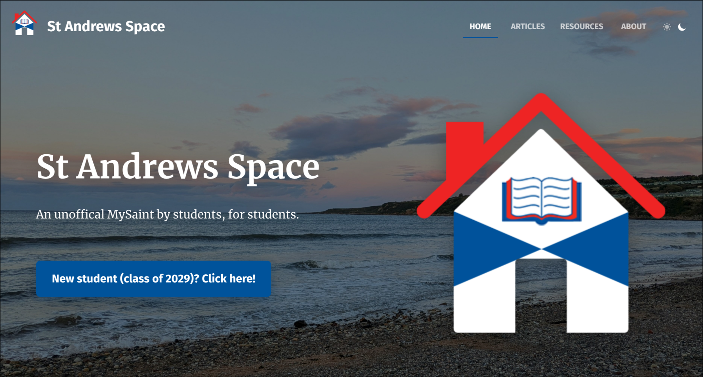

# St Andrews Space

> An unofficial [MySaint](https://mysaint.st-andrews.ac.uk/) by students, for students.

## What is this?

This is the source code for the **[https://st-andrews.space](st-andrews.space) website** - a student hub for current or prospective students at the [University of St Andrews](https://www.st-andrews.ac.uk/).

## How do I contribute?

Feel free to reach out to me at [thatother.dev](https://thatother.dev), by [creating an issue on this repository](https://github.com/ThatOtherAndrew/st-andrews-space/issues/new), or by contacting **`as714`** if you're at the University of St Andrews.

Or, if you really *really* know what you're doing, create a pull request!
